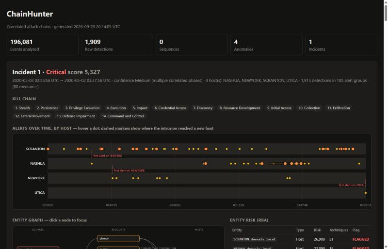
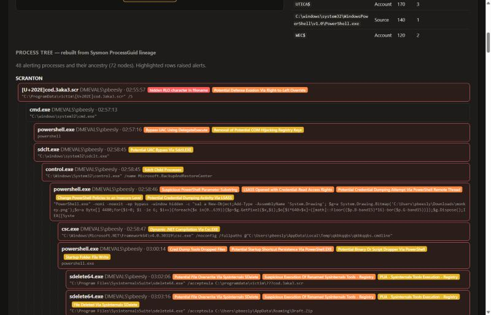
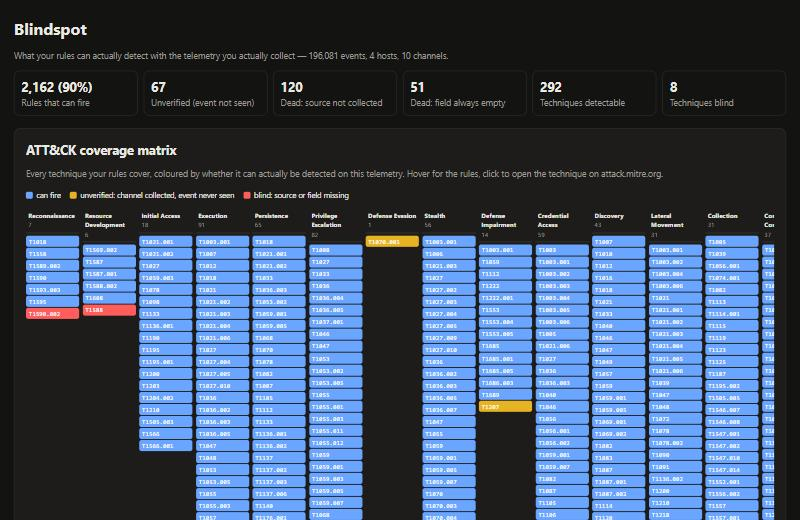
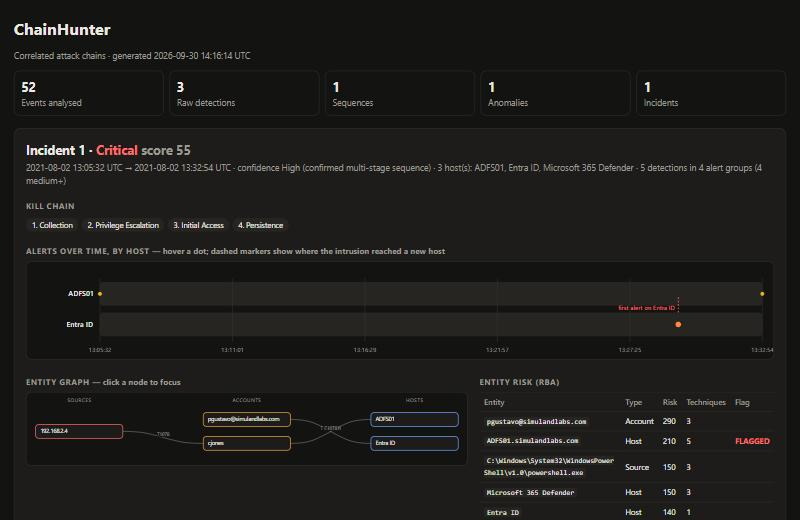

# ChainHunter

**Alerts aren't incidents.** ChainHunter turns Windows, Entra ID and Microsoft 365 logs into correlated attack chains. It runs Sigma signatures, multi-stage sequences, behavioural anomalies and risk-based alerting, links the results into incidents, and writes the report. It also tells you what your rules **can't** see.

- **Tested on real attacks.** 25/30 public attack recordings detected, and MITRE's APT29 emulation (196,081 events) reconstructed as one incident.
- **Blindspot.** True ATT&CK coverage measured against the logs you *actually* collect, with the logging fixes that would restore each dead rule.
- **Endpoint + cloud in one incident.** A real Golden SAML attack linked from the on-prem ADFS server to Entra ID.
- **Scales on a laptop.** A Parquet + DuckDB lake, 10M events in 394 s with 4 workers, results proven identical to the in-memory engine.
- **Analyst tooling.** Live mode, suppression with impact checks, rule-health verdicts, and an AI summary that must cite evidence for every sentence.

**APT29 (MITRE ATT&CK Evaluations): one incident across 4 hosts, with the intrusion's spread visible over time**


**The process tree rebuilt from Sysmon lineage.** It starts at the real payload, `cod.3aka3.scr`, whose hidden right-to-left-override character disguises it as a `.doc`:


<details><summary><b>More screenshots:</b> Blindspot ATT&amp;CK matrix · Golden SAML endpoint-to-cloud incident</summary>



</details>

**Learning from this project:** [`docs/STUDY_GUIDE.md`](docs/STUDY_GUIDE.md) explains every concept and every bug real data exposed: problem, how it was found, the fix, the concept, and the interview question it answers.

## Why it's different
| Layer | What it catches | Why it matters |
|---|---|---|
| **Signatures** | Sigma rules; SigmaHQ-compatible via logsource → EventID mapping | Known technique patterns |
| **Sequences** | Ordered steps joined on entities, e.g. *account Kerberoasted → same account logs on* | Proves the attack *progressed* (the crack worked), not just that it was attempted |
| **Anomalies (UEBA-lite)** | First-seen auth sources and host fan-out, learned from a baseline window | Catches the attacker with **zero signatures**; in the demo it independently flags the attacker IP |
| **Risk-based alerting** | Risk scored per entity across all layers, flagged when it crosses a threshold or spans many techniques and phases | Turns many weak signals into one high-fidelity alert, the Splunk ES RBA model |
| **Correlation** | Union-find over shared accounts, sources and hosts within a time window | One incident with ordered kill-chain phases instead of 11 separate alerts |

## Outputs
| File | Contents |
|---|---|
| `report.md` | CDSA-format incident report: Executive Summary (with auto-drafted containment actions for flagged entities) → RBA table → numbered technical steps (Objective / KQL-SPL-EQL / Figure / Finding / Kill Chain + ATT&CK) → IOCs → Timeline |
| `report.html` | Interactive report: **attack graph** (sources → accounts → hosts, click a node to focus its path and timeline), RBA table, timeline with hunting queries and raw evidence drawers. Light and dark themes. |
| `attack_layer.json` | ATT&CK Navigator heatmap of detected techniques |
| `incidents.json` | Machine-readable incidents for SOAR or ticketing hand-off |

## Quick start
```bash
pip install -e ".[evtx,dev]"
python samples/make_demo.py                 # synthetic GOAD-style dataset
chainhunter hunt samples/goad_demo.jsonl -o out
chainhunter validate -v                     # lint + embedded tests + ATT&CK coverage
chainhunter convert --to eql                # compile rules to KQL / SPL / EQL
pytest -q
```
Inputs: `.evtx`, or `.json/.jsonl/.ndjson` (flat, or Elastic/Winlogbeat `winlog.event_data.*`). Security 4688 fields are aliased to Sysmon names, so one `process_creation` rule covers both.

Bring your own Sigma: `chainhunter hunt logs/ -r rules -r path/to/sigma/rules/windows`. Rules that use unsupported modifiers are skipped with a warning; they don't crash the run.

## Detection-as-code
Every rule carries its own positive and negative test cases:
```yaml
tests:
  match:   [ {EventID: 4662, SubjectUserName: bob,    Properties: "{1131f6aa-...}"} ]
  nomatch: [ {EventID: 4662, SubjectUserName: "DC01$", Properties: "{1131f6aa-...}"} ]
```
`chainhunter validate` lints each rule (condition references, ATT&CK tags, level, sequence step and join integrity, translatability), runs its tests and prints ATT&CK coverage. It exits non-zero on failure, so CI blocks broken detections from merging.

## The Sigma compiler
Rules compile from their detection logic, so queries never drift from what the engine runs:
```
sequence with maxspan=14400s
  [any where ((event.code == "4769" and winlog.event_data.TicketEncryptionType : "0x17") and not ...)] by winlog.event_data.ServiceName
  [any where (event.code == "4624" and (winlog.event_data.LogonType : "3" or ...))] by winlog.event_data.TargetUserName
```
Sequence rules compile to native **EQL `sequence ... by`**, so the same cracked-credential-reuse logic can be deployed as a live Elastic detection rule. Signature rules also compile to KQL and to SPL (with `bin | stats | where` for thresholds).

## Rule pack
| ID | Type | Detection | ATT&CK |
|---|---|---|---|
| ch-0001 | signature | Kerberoasting: RC4 service-ticket burst vs AES baseline | T1558.003 |
| ch-0002 | signature | LSASS access via comsvcs.dll MiniDump | T1003.001 |
| ch-0003 | signature | NTLM network logon from unmanaged workstation name | T1550.002, T1078 |
| ch-0004 | signature | Directory replication by non-machine account (DCSync) | T1003.006 |
| ch-0005 | signature | Member added to privileged group | T1098 |
| ch-0006 | signature | Security/System event log cleared | T1070.001 |
| ch-s001 | sequence | Kerberoasted account later authenticates (cracked credential reuse) | T1558.003 → T1078.002 |
| ch-s002 | sequence | Unmanaged-host logon → LSASS access on the same host | T1550.002 → T1003.001 |
| ch-s003 | sequence | Account from unmanaged host → directory replication | T1078 → T1003.006 |
| ch-a001 | anomaly | First-seen authentication source | T1078 |
| ch-a002 | anomaly | Anomalous host fan-out | T1021 |

## Architecture
```
ingest ─► signatures ─► sequences ─► anomalies ─► correlate + RBA ─► report
EVTX/ECS   Sigma engine   ordered,      baseline-     union-find on       MD (CDSA) / HTML graph /
normalize  + thresholds   entity-joined  learned       entities, entity    Navigator / JSON
+ aliases                 steps                        risk scoring
```

## Tested on real attack telemetry
`chainhunter bench` replays 30 public attack recordings (26 from [EVTX-ATTACK-SAMPLES](https://github.com/sbousseaden/EVTX-ATTACK-SAMPLES), 4 from [OTRF Security-Datasets](https://github.com/OTRF/Security-Datasets)). `datasets/fetch.py` downloads them and verifies each against a pinned SHA-256; they are not vendored into this repo. CI re-scores every push.

Only alerts of **medium severity or higher** count as detections; informational/low rules are context.

| Rule set | Samples detected | Labelled expectations |
|---|---|---|
| ChainHunter's own pack (10 rules) | 16/30 | 7/7 |
| + SigmaHQ Windows rules (2,390 loaded, 20 skipped) | **25/30 (83%)** | 7/7 |

```bash
python -m chainhunter bench -r rules -r path/to/sigma/rules/windows
```

With SigmaHQ loaded, the new hits are on the technique each sample actually demonstrates: overpass-the-hash, PsExec service execution, Impacket WMIExec, DCShadow, RdrLeakDiag/ProcDump/Task Manager LSASS dumps, PowerShell LSASS access, vshadow proxy execution.

Still missed (5/30): a service installed with `cmd.exe` as its image (7045), renamed PsExec over IPC$ (5145), renamed PsExec named pipes, WMI execution seen only through parentless 4688 events, and a hidden temporary scheduled task (4698/4699).

Honest caveat: in the own-pack run, 6 of the 16 hits are the log-clearing rule, because the researchers cleared the logs before recording. They're true positives, but not the attack those samples demonstrate.

### Engine bugs found by benchmarking against SigmaHQ
Running 2,400 community rules against real telemetry exposed correctness bugs, now fixed with regression tests:
- **`Provider_Name` was never populated.** SigmaHQ names the event provider `Provider_Name`, so 86 rules could never fire. Found by Blindspot. The fix brought 44 of them to life and caught the ntdsutil sample (24/30 → 25/30).
- **`logsource.service` wasn't enforced.** An Application-log AV-keyword rule fired on a Sysmon event whose path contained `mimikatz`. Rules are now restricted to their channel.
- **Unmapped logsource categories matched every event.** A `file_change` rule fired on `dns.exe` *network* connections. Categories now map to their Sysmon EventIDs, and categories that need telemetry ChainHunter doesn't ingest (ETW `file_access`/`file_rename`) are skipped instead of guessed.

### Full campaign: APT29 (MITRE ATT&CK Evaluations, Day 1)
The whole OTRF recording of MITRE's APT29 emulation: **196,081 real events, 4 hosts, 385 MB**, run against 2,400 rules in about 7 minutes. An EventID index means each rule only scans the event types it can match.

- **1,912 detections → 1 incident → 105 alert groups**, spanning 3 hosts: SCRANTON → NASHUA → NEWYORK (the DC). UTICA is touched only at the very end.
- The top-risk account is `DMEVALS\pbeesly`, the user MITRE's emulation compromised.
- The process tree starts at the real initial-access payload, `[U+202E]cod.3aka3.scr` (a right-to-left-override masquerade that displays as `rcs.3aka3.doc`), launched by `explorer.exe`. From there: `cmd.exe → powershell.exe → sdclt.exe` (UAC bypass).

```bash
python datasets/fetch.py      # includes the APT29 day-1 campaign (13 MB zip, sha256-pinned)
python -m chainhunter hunt datasets/cache/otrf/apt29_evals_day1_manual_*.json -r rules -r path/to/sigma/rules/windows -o out/apt29
```

The report is built for incidents this size: alert groups with severity/host/text filters, an **alerts-over-time swimlane per host** that shows lateral movement, an entity graph capped to the highest-risk entities, and a **process tree rebuilt from Sysmon ProcessGuid lineage**. Informational/low alerts (971 of the 1,912) are kept as context, not story.

## Scale: a Parquet lake + DuckDB
Python shouldn't hold billions of events, and ChainHunter doesn't. Ingest once into a compressed, columnar lake, then every rule runs as SQL inside DuckDB. Only matches come back to Python.

```bash
python -m chainhunter lake path/to/logs -o lake/          # streams in bounded chunks
python -m chainhunter hunt --lake lake/ -r rules -r path/to/sigma/rules/windows
python -m chainhunter blindspot --lake lake/ -r rules     # telemetry profile computed inside DuckDB
```

| APT29 day 1 (196,081 real events) | In-memory engine | Lake |
|---|---|---|
| Storage | 368 MB JSON | **5.2 MB Parquet (zstd), ~70× smaller** |
| Hunt with 2,400 rules | ~7 min | **~32 s** |
| Signature hits | 1,914 | **1,914** |

**Scale test, ~10M events.** The real APT29 recording replayed 50× inside DuckDB (each copy shifted a day, with its own host names; real event content, synthetic volume): **9,804,050 events, 200 hosts, 257 MB of Parquet.**
- 2,400 rules → **95,700 detections, exactly 1,914 × 50** → **50 incidents of exactly 1,914 detections each**. Correlation neither merged nor split a single intrusion.

Profiled and optimised against that 10M-event lake (same results at every step; lake-vs-memory parity re-proven on the 30 benchmark recordings after each change):

| | First version | Now |
|---|---|---|
| Rules falling back to Python / skipped | 22 / 6 | **0 / 0**: all 2,400 run inside DuckDB |
| Detection | 985 s (~10k events/s) | **~600–670 s** single process · **394 s (~25k events/s) with `--workers 4`** |
| Correlation | 61 s | **2.4 s** |
| Columns per fetched row | 389 | **61** (full width only for 50 keyword-rule rows) |

What made the difference:
- **Polarity-aware widening.** A Sigma feature SQL can't express (CIDR, an RE2-incompatible regex, `[ ]` wildcards) becomes TRUE in a positive position or FALSE under NOT. The SQL can only admit *more* rows, and the Python re-check restores exactness. That removed every Python fallback.
- **One bad regex was failing whole batches.** A SigmaHQ pattern uses a PCRE-style `⠀` escape that DuckDB's RE2 rejects, and each failure re-ran 100 rules one at a time. Patterns are now validated at compile time.
- **Keyword rules.** The ~100-keyword AV-signature rule rescanned an all-columns blob once per keyword: 100 s on APT29 alone. Keywords now run in one regex pass, and rules whose log channel isn't in the lake are pruned before any scan.
- **Linear-time correlation.** For each entity key, track the earlier detection with the latest end time. That yields the same components as the all-pairs version (checked against it on randomised trials in the tests): 61 s → 2.4 s.

- **Multi-process fan-out (`--workers N`).** Lake files are split across processes, each with its own DuckDB (threads = cores ÷ workers) running the Python re-check on its share. Hits are merged *before* thresholds, so a burst split across files still counts. It produces the same 95,700 detections, and a parity test covers it.

Honest reading: ~25k events/s on a 4-core i5 laptop means a billion events takes about 11 hours on one machine. The remaining cost is DuckDB evaluating about 2,200 rules' string predicates. It's CPU-bound, and fan-out already splits it by file, so the same code scales with cores and, by giving each machine its own file slice, with machines.

How it's built, and the problems real data forced:
- **Exactness by construction.** Each rule compiles to a SQL *superset* pre-filter, and every returned row is re-checked by the exact Python matcher. On all 30 benchmark recordings the lake and in-memory engines produce **identical** detections (189 = 189, compared one by one), and a parity test guards it in CI.
- **Batched, two-phase execution.** The first version ran `SELECT *` per rule, costing about 136 ms each even with zero matches (389 columns). Rules now run about 100 per vectorised scan that returns only row ids, and matched rows are fetched once. 322 s → 32 s.
- **IOC lists.** "Vulnerable Driver Load" lists thousands of hashes and spent **10.7 s just in query planning**, on a lake with zero driver-load events. Long value lists now compile to one case-insensitive regex alternation.
- **Dead-rule pruning.** Rules whose event types don't exist in the lake are never queried (149 on APT29). That's Blindspot's logic applied to execution.
- **Case-variant fields.** Real APT29 data has both `IpAddress` and `Ipaddress`, which DuckDB rejects as duplicate columns. Variants are merged into one column, and every original spelling stays queryable.
- **Known limit.** 6 SigmaHQ rules use free-text keyword search with no event-type filter. They'd need a full scan, so lake mode reports them as skipped rather than silently scanning.

## Grounded AI analyst (local or Claude)
An LLM drafts the executive summary, attack narrative and containment steps. **ChainHunter then checks every sentence**; the model doesn't get to decide what counts as supported.

```bash
# local and offline: runs on a 4 GB laptop GPU (GTX 1650) via Ollama
python -m chainhunter hunt logs/ -r rules --ai ollama:qwen2.5:3b
# Claude API (claude-opus-5-5), when logs are allowed to leave the machine
python -m chainhunter hunt logs/ -r rules --ai claude
```

- The model only sees an **evidence pack**: the incident's medium+ alert groups, each with an ID (`E1`, `E2`…), time, host, rule, ATT&CK technique, actor and one key field. It must answer in a fixed JSON schema, with the evidence IDs each sentence relies on.
- **The verifier flags a sentence as UNSUPPORTED** if it cites nothing, cites an ID that doesn't exist, or mentions a host, account, IP or ATT&CK technique that isn't in the evidence it cites. The report shows a grounding score, e.g. *11/13 claims verified*.
- Why it matters: SOCs often can't send logs to a cloud model, and small local models do invent hosts and techniques. A local model plus a verifier gives you a usable draft with the hallucinations marked. The tests feed the verifier invented hosts, wrong citations, fake IPs and fake evidence IDs, and it catches each one.

Setup for the local model (about 4 GB of disk):
```bash
setx OLLAMA_MODELS "D:\Ollama\models"      # optional: keep models off a full C: drive
winget install --id Ollama.Ollama -e
ollama pull qwen2.5:3b
```

## Analyst feedback: scoped, expiring suppressions
```bash
python -m chainhunter suppress add --rule "Non Interactive PowerShell Process Spawned" --where host=SCRANTON --where "ParentImage=*\ccmexec.exe" --reason "SCCM client" --expires 90d
python -m chainhunter hunt logs/ -r rules --suppress suppressions.yml
```
Guardrails, because careless suppression is how a SOC goes blind:
- **Scoped, not global.** A rule plus conditions on host, account or any field. `rule: "*"` is refused without `allow_broad`.
- **Attributed and expiring.** Author, reason and created date are recorded, and expired entries stop applying (with a warning).
- **Critical rules need `allow_critical`.**
- **Suppression hides an alert, never a chain.** Sequence rules are evaluated on the *unsuppressed* hits, so muting a noisy step can't mute the multi-stage attack it belongs to (covered by a test).
- **Stale entries are reported.** A suppression that matched nothing this run is flagged, so the list doesn't rot.

### Before approving a suppression: impact check
```bash
python -m chainhunter suppress impact logs/ -r rules --rule "NTLM Network Logon from Unmanaged Workstation Name"
```
Replays the full pipeline with and without the candidate suppression and reports what you'd lose, not just a count:
```
Suppression impact: RISKY - 3 alert(s) would be hidden
  Incident 1 (Critical -> Critical): 3 alert(s) hidden
    ! hides the incident's earliest alert (NTLM Network Logon from Unmanaged Workstation Name)
    ! hides the first sign of compromise on kingslanding
    ! removes the 'Lateral Movement' phase from the incident entirely
```
Narrowed to `--where actor=jon.snow`, the same rule is **SAFE**: one alert hidden, no key evidence lost. The command exits non-zero on RISKY, so a CI step can block the change.

### Rule health: which rules to trust, tune or delete
```bash
python -m chainhunter rulehealth --lake lake/ -r rules -r path/to/sigma/rules/windows --bench
```
Each rule gets one verdict from four signals: can it fire here (Blindspot), did it catch real attack recordings (bench), how loud is it (alerts per million events), and is it tested. On APT29 plus the 30 recordings: **76 TRUST · 2 TUNE · 152 DEAD**. The two TUNE rules are loud *because APT29's own Python implant triggers them*. On attack data "loud" can be the attack itself, so the advice is "scope it", never "delete it".

## Cloud identity: Entra ID, Microsoft 365, Defender XDR
ChainHunter reads Microsoft Sentinel table exports (`AuditLogs`, `SigninLogs`, `OfficeActivity`, `AzureActivity`, …) and Defender XDR advanced-hunting rows next to Windows events, and runs SigmaHQ's Azure/M365 rules on them.

```bash
python -m chainhunter hunt windows.json auditlogs.json officeactivity.json m365d.json -r rules -r sigma/rules/windows -r sigma/rules/cloud
```

Tested on OTRF's real **Golden SAML → ADFS → mailbox access** recording (Windows + Entra ID + Office 365 + Defender XDR):
- **One Critical incident spanning on-prem and cloud.** An uncommon process reading the ADFS configuration database on `ADFS01` is linked to an application credential being added in Entra ID.
- **Linked by federated domain, not by entity.** With Golden SAML, the cloud identity is *forged*, so the two stages share no account, IP or host, and plain entity correlation can't connect them. The sequence engine's `domain` join links `ADFS01.simulandlabs.com` to `…@simulandlabs.com`.

What real cloud data exposed:
- **Two pipelines, two field names.** SigmaHQ's Azure rules use the diagnostic-export shape (`properties.message`, `userAgent`), while Sentinel exports the same events as `ActivityDisplayName` and `UserAgent`. Both names are now populated.
- **An en-dash defeated an exact match.** Real Entra ID writes `Update application – Certificates and secrets management ` (en-dash, trailing space), while SigmaHQ's rule uses a hyphen. The rule never fired on real data until operation names were normalised.
- **Platform isolation.** Every event is tagged `azure`, `m365`, `m365d` or Windows, so a Windows keyword rule can't fire on an Entra ID record that happens to contain the word, and vice versa.
- **Coverage gap.** Defender XDR logged Directory Services replication *from the ADFS server*, and no SigmaHQ rule covers Defender XDR tables.

## Live mode
```bash
python -m chainhunter watch -r rules                                    # this machine's logs (admin terminal)
python -m chainhunter watch -r rules --replay recording.json --speed 600 # stream a recording through the engine
```
Polls Windows channels through `wevtutil`, tracking record IDs so nothing is read twice. It keeps a sliding window of events and detections, and announces new alerts, new incidents and **escalations** as they happen:
```
ALERT    13:13:09  high     NTLM Network Logon from Unmanaged Workstation Name  host=kingslanding
INCIDENT Medium   opened: 1 detections, 1 host(s), Lateral Movement
ALERT    14:05:42  critical LSASS Memory Access via comsvcs.dll MiniDump  host=castelblack
INCIDENT Critical escalated from Medium: 6 detections, Lateral Movement -> Credential Access
```
Unreadable channels are reported, not silently skipped: Security and Sysmon need an elevated terminal. Burst (threshold) rules are re-evaluated over the whole window, because the first version alerted DCSync twice when one burst was split across two polls.

## Blindspot: what can you *actually* detect?
ATT&CK coverage dashboards count rule tags: what a SOC *thinks* it detects. `blindspot` reads your real logs and checks, for every rule, whether it can ever fire on them:

```bash
python -m chainhunter blindspot path/to/logs -r rules -r path/to/sigma/rules/windows -o out/blindspot
```

On the real APT29 telemetry (196,081 events, 20 seconds):

| | |
|---|---|
| Rules that can fire | 2,162 of 2,400 (90%) |
| Unverified: channel collected, event never seen (rare, or audit policy off) | 67 |
| Dead: the required log source is never collected | 120 |
| Dead: events present, but a required field is always empty | 51 |
| ATT&CK techniques detectable / unverified / blind | 292 / 6 / 8 |

It separates **proven gaps** (the log channel or field is missing) from **unverified** ones. For example, event 1102 only appears when someone clears a log, so its absence on a collected Security channel means "verify the audit policy", not "you're blind". It also draws an **ATT&CK matrix** coloured by detectability. It ranks the fixes by techniques gained. For this environment: populate `DestinationHostname` on Sysmon 3 (+18 rules, +4 techniques), collect the Application log channel (+23 rules), enable Sysmon 6 driver loads (+10). It also checks log health: host UTICA sends no PowerShell or System logs while its 3 peers do.

**It caught a false positive in the hunt engine.** A SigmaHQ Sysmon WMI rule had fired on APT29, yet Blindspot said Sysmon WMI events were never collected. Blindspot was right: the rule had matched System-log *Kernel-Boot* event 20 and a TerminalServices event 21, which reuse the same numbers. The matcher now requires the Sysmon channel for Sysmon event IDs, with a regression test.

How it decides:
- **Dead: no events.** Required event IDs are computed from the rule's condition (an over-approximation, so it never wrongly calls a rule dead), then checked against what was collected. Sysmon IDs only count when they come from the Sysmon channel.
- **Dead: empty field.** Fields every matching path needs (an under-approximation, again never claiming too much) are checked against fields that are actually populated. The classic case is 4688 without *Include command line in process creation events*.
- **Health.** Flags a host missing a log source that most of its peers send. Also flags a source that goes silent mid-window, but only on captures of 6 hours or more, because in a 30-minute recording a quiet source is just the attacker finishing.

### What real logs taught the ingest layer
Synthetic data never exposed any of these; real recordings exposed all of them:
- Hex fields are zero-padded (`GrantedAccess 0x00001010`), so exact-match rules silently miss. Values are now canonicalised.
- The same attacker appears as `172.16.66.1` and `::ffff:172.16.66.1`. IPv4-mapped IPv6 is now normalised.
- Event 1102 (log cleared) stores who did it in `<UserData>`, not `<EventData>`.
- ESENT/Application events use unnamed `<Data>` fields, and `LogonProcessName` is logged with a trailing space.
- OTRF's APT29 export stores the U+202E right-to-left override **double-encoded** (`‮`), so no rule could see the masquerade. Mojibake is now repaired at ingest, which is what made SigmaHQ's RLO rule fire on the real initial-access payload.
- SigmaHQ now uses ATT&CK v18's split of Defense Evasion into **Stealth** and **Defense Impairment**, so tactic mapping supports both the old and new names.

## Roadmap
- **Beyond one machine:** run `--workers` slices on separate machines and merge the hits. Partition the lake by day and host (Hive layout), so time-bounded hunts skip whole files.
- **AI accuracy benchmark:** grounding score per model (local 3B models vs Claude) across the real incidents.
- **AI triage per alert group** (likely true or false positive, with citations), and **suppression suggestions** an analyst approves.
- Live Elastic/Splunk connectors, and pushing compiled EQL sequences as Elastic detection rules
- LLM-drafted executive summary grounded in `incidents.json`

## Background
Built from a real threat hunt I ran in an Elastic lab: a GOAD Active Directory forest compromised through stolen credentials, credential dumping and replication abuse. I reconstructed that chain by hand over hours; ChainHunter reconstructs it in under a second. The bundled dataset is **synthetic and fictional**.

## License
MIT
